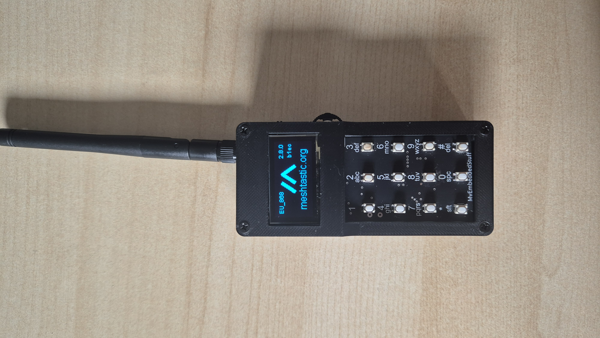
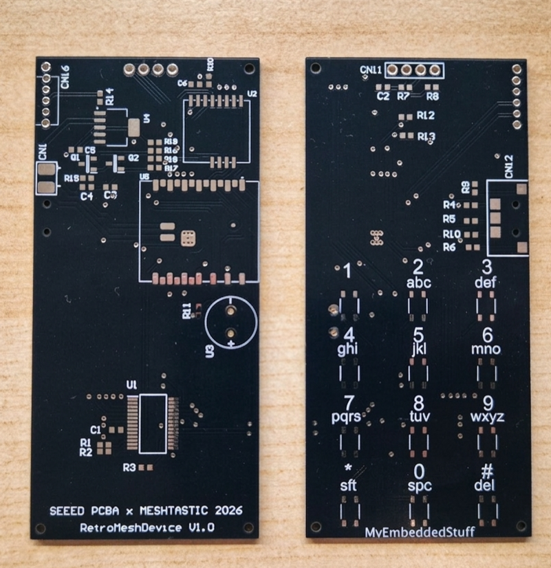

# RetroMeshDevice 

An off-grid handheld communicator built for the **Meshtastic Build-Off 2026** hardware competition. 

The goal is to build a standalone device that runs Meshtastic natively, using an ESP32-S3 and a custom 12-button T9 physical keypad (driven by an MCP23017 I/O expander).



---

## 📖 What this project does

RetroMeshDevice (RMD) is a custom-built, standalone Meshtastic node in a retro phone form factor. Unlike phone-paired setups, it's a self-contained device with its own screen, keypad, battery, and LoRa radio built from scratch around a T9 physical keypad instead of a touchscreen or QWERTY layout.

It's designed as an alternative for people who want a dedicated, pocketable Meshtastic node without depending on a smartphone to configure, send, or read messages

---



I am documenting the entire design and assembly process step-by-step on my blog:
* **Part 1 (Schematic & Design):** [myembeddedstuff.com/meshtastic-build-off-2026-retromeshdevice](https://myembeddedstuff.com/meshtastic-build-off-2026-retromeshdevice)
* **Part 2 (PCB Assembly):** [myembeddedstuff.com/meshtastic-build-off-2026-pcb-assembly](https://myembeddedstuff.com/meshtastic-build-off-2026-pcb-assembly)
* **Part 3 (Firmware Validation & Power Consumption):** [myembeddedstuff.com/meshtastic-build-off-2026-hardware-bring-up](https://myembeddedstuff.com/meshtastic-build-off-2026-hardware-bring-up)

---

### 📂 Repository structure

* **`/case`** — 3D printable case STEP file.
* **`/hardware`** — Schematic diagrams and Bill of Materials (BOM).
* **`/firmware`** — Firmware source code and utilities:
  * **`/Meshtastic`** — Custom Meshtastic variant for this board, ready to compile.
  * **`/Test`** — Standalone hardware self-test firmware for quick board bring-up validation.
  * **`/Bin`** — Precompiled binary (Meshtastic v2.8).
* **`/images`** — Project photos and renders.

---


## 🔗 How it uses Meshtastic

RetroMeshDevice runs a **custom Meshtastic firmware variant** rather than stock Meshtastic, because out-of-the-box Meshtastic firmware doesn't support the MCP23017 I/O expander that drives this board's T9 keypad.

To make this work, I implemented a full MCP23017 keyboard driver for the Meshtastic firmware (interrupt handling, key debounce/multi-tap/long-press logic, I2C device detection) and submitted it upstream:

👉 [meshtastic/firmware PR #11015 — feat: add driver for MCP23017](https://github.com/meshtastic/firmware/pull/11015)

Until this PR is merged into the official Meshtastic repository, you'll need to apply these changes manually (see **Installation** below).

---

## 🚀 Installation & running

1. **Clone the official Meshtastic firmware repo:**
```bash
   git clone https://github.com/meshtastic/firmware.git
   cd firmware
```

2. **Add MCP23017 support:**
   - Check if [PR #11015](https://github.com/meshtastic/firmware/pull/11015) has already been merged into `develop`.
   - **If merged:** skip to step 3.
   - **If not merged yet:** copy over the modified files from that PR into your local clone (`src/detect/ScanI2C.*`, `src/detect/ScanI2CTwoWire.cpp`, `src/input/MCP23017Keyboard.*`, `src/input/cardKbI2cImpl.cpp`, `src/input/kbI2cBase.*`, `src/main.cpp`).

3. **Add the board variant:**
   - Copy the contents of this repo's [`/FW_Meshtastic`](FW_Meshtastic) folder into the corresponding `variants/` folder of your Meshtastic firmware clone.

4. **Build and flash:**
```bash
   pio run -e retroMeshDevice -t upload
```
   This compiles the firmware for the `retroMeshDevice` environment and uploads it directly if the board is connected via USB.

5. **Alternative — use the precompiled binary:**
   - If you don't want to build it yourself, a precompiled binary (Meshtastic v2.8) is available in [`/Bin`](Bin).

6. **Quick hardware test (optional):**
   - Before flashing full Meshtastic firmware, you can validate the board itself using the standalone self-test firmware in [`/FW_TEST`](FW_TEST) — it checks the buzzer, battery ADC, MCP23017/keypad, OLED, and SX1262 radio.

---


### 🏆 Support the project!
This project is officially entered in the contest. If you like the design, please drop a reaction (like a 👍 or ❤️) on the official submission entry here:

👉 [Seeed Studio Build-Off Entry #10](https://github.com/Seeed-Projects/meshtastic-build-off-2026/issues/10)

### 📜 License

This project (hardware design and firmware) is licensed under the **GNU General Public License v3.0** — see [LICENSE](LICENSE) for the full text.